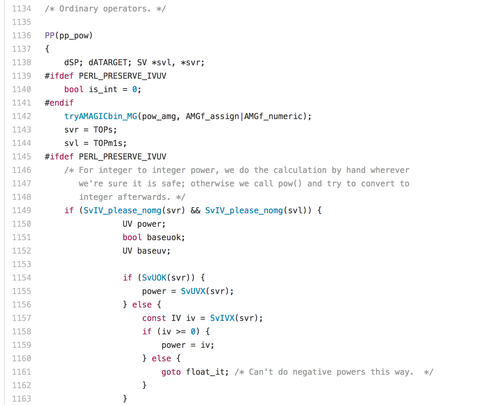

# Subroutines

Brandon Seah

Perl Course 2017

---

## Language is built on abstraction

> - “Wood fibers flattened, stacked, attached”
> - “Paper stack, attached”
> - “Book”

---

## Math is built on abstraction

$\frac{n_1 + n_2}{2}$

$\frac{n_1 + n_2 + n_3}{3}$

etc.

“Sum”, “Mean”

---

## Code is built on abstraction

```perl
my $number = 3;
my $result = $number*$number*$number;
my $result2 = $number**3; # Built-in operator
```

---

## Perl the language vs. `perl` the interpreter

Perl is written in C



---

## Levels of abstraction

> - Perl is written in C
> - C compiler is written in ... C (?!)
> - Interpreter translates human-readable code to machine code
> - Machine code is specific to hardware type

---

## Machines simulating machines

[Minecraft computer (Trailer)](https://youtu.be/go5qdMKZs-M)

[Virtual machines](https://en.wikipedia.org/wiki/Virtual_machine)

---

## Make your own abstractions

```perl
my $number = 3;
my $result = power($number,2);
sub power {
  my ($num, $exp) = @_; # Inputs
  my $output = 1;
  for (my $i=1; $i <= $exp; $i++) {
    $output = $output * $num;
  }
  return $output; # Output
}
```
What happens if `$exp <= 0`?

---

## Benefits of abstraction

 * Avoid repetition
   * Code is cleaner
   * Changes only made once
   * Reduce human error
 * Build abstractions
   * Easier to read code
   * Easier to write code

---

## `sub` blocks can go anywhere

```perl
sub say_hello { print "Hello!\n"; }
say_hello();
```

Equivalent to:

```perl
say_hello();
sub say_hello { print "Hello!\n"; }
```

---

## Scoping of variables in a `sub` block

```perl
sub cube_it {
    my ($input) = @_;
    my $out = $input***3;
    return $out;
}
print $out; # Doesn't exist outside block
```

---

## Input to a function

```perl
sub cube_it {
    my ($input) = @_;
    my $out = $input***3;
    return $out;
}
```

 * Inputs are passed to a special array called `@_`
 * Even if there is only one input, still goes to an array

---

## Calling a subroutine with input and return value

```perl
sub cube_it {
    my ($input) = @_;
    my $out = $input***3;
    return $out;
}
my $answer = cube_it(3);
print $answer."\n";
```

---

## Exercise: Matching Fasta headers

Convert the following script to use a subroutine

```perl
while (<>) {
  if ($_ =~ m/^>/) {
    print "Header found\n";
  } else {
    print "Not a header\n";
  }
}
```
<small>File: XXX</small>

---

## Exercise: Matching Fasta headers

One possible solution:

```perl
while (<>) {
  print isheader($_);
}
sub isheader {
  my ($input) = @_;
  if ($input =~ m/^>/) {
    return "Header found\n";
  } else {
    return "Not a header\n";
  }
}
```

---

## Calling a subroutine with no return value

```perl
sub repeat_it {
    my ($input) = @_;
    print "You said: $input."\n";
}
repeat_it("Hello");
my $test = repeat_it ("Hello");
print $test; # What happens?
```

---

## Calling a subroutine with no inputs

```perl
sub random_fruit {
    my @fruit = ("apple","banana","orange","raspberry");
    my $random = int(rand(3));
    return $fruit[$random];
}
my $choice = random_fruit();
print $choice."\n";
```

What happens if you wrote `my $choice = random_fruit;` instead?

---

## Additional material

---

## Passing arrays/hashes to subroutine

 * Use *references* (see Day 2)

```perl
my @arr = (1, 2, 3, 4, 5);
add_arr(\@arr); # Notice backslash before @arr
sub add_arr {
  my $arr_ref = @_;
  my @array = @$arr_ref; # Dereference
  my $sum = 0;
  foreach my $num (@array) {
    $sum += $num;
  }
  return ($sum);
}
```

---

## Peculiarities of subroutines in Perl

 * Called "subroutines" instead of "functions"
 * Need parantheses even for functions without inputs
 * Accepts only lists of scalars as inputs
 * Input arguments are not directly defined
 * In older versions of Perl, subroutines needed sigil `&`
